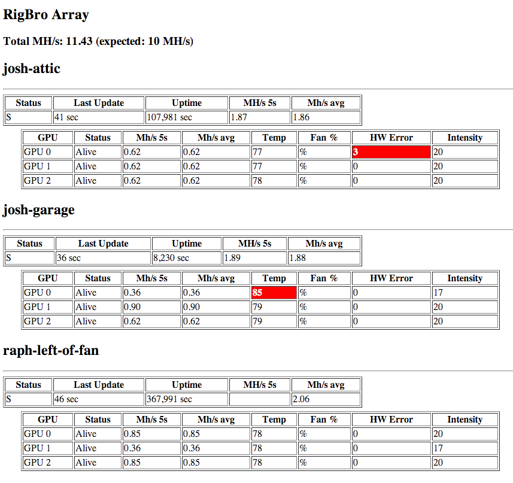

RigBro
======

Free, open source, easy and customizable client/server based cryptocoin mining rig monitor. Supports an unlimited number of rigs. RigBro's got you covered!

Why do we need another mining rig monitor? I hate reinventing the wheel, but as they say, necessity is the mother of invention.
I wasn't happy with any of the existing rig monitoring software out there - they either require you to connect to each rig directly (so you have to configure static IPs, port forwarding/firewall settings on each rig you want to monitor, also comes with security issues),
aren't free or open source, focus too much on display/fancy css - turns out `<table>` works well for tabular data (who knew!), or were using the rigs themselves to send out downtime alerts (what happens if power or Internet goes out???).

Anyway, there's my rant. Hopefully RigBro is as useful to you as it's been to me. Pull requests welcome.

Benefits
======

* No polling. Only push. You don't have to open ports or change router/firewall settings to use RigBro. Requires only a connection to the Internet on each rig you want to monitor (which you obviously have, otherwise how do you mine), plus a central server to post data and display the status page.
* See all information (khash rate, temps, HW erros, etc) about all your rigs on one easy auto-refreshing page. Whatever info CGMiner can report is what RigBro can display.
* Set a minimum expected MH/s for your mining rig pool - even if just one card misbehaves, you'll know about it within minutes.
* Easy to configure with third-party e-mail/SMS alert services to notify you within minutes of failure.

Compatibility
======

Works with CGminer.

Requires PHP on each rig, PHP+Apache on server monitor. Tested on BAMT, SMOS, and Ubuntu Linux. Probably compatible with Windows rigs as long as PHP is installed and the cron script is running, but not tested.

Screenshot
======

Installation
======

I recommend keeping a dedicated, always-on server into which each of your rigs will post its current data to, for example a micro instance from AWS.

Client (repeat on each rig to monitor)
------
Be sure CGMiner is configured to listen for api requests on a port (for example, 4028). Set api-listen: true in your cgminer.conf file to do this.

Clone this repo into /home/script or download and untar if you don't have git installed.

`cd /home/script`  

`git clone https://github.com/joshliptzin/rigbro.git`  

`cd rigbro`

Edit client/config.php to set the unique rig name, ip address, and port for each rig you want to monitor from that instance. I recommend monitoring only 127.0.0.1 from each rig (so you don't have to open up any ports for remote access), unless you're behind a firewall with no inbound access on CGMiner's api port. You'll also need to set the URL to the postback script.

`nano client/config.php`

Install php with curl support on all rigs and monitor

`apt-get install php5-common php5-cli php5-curl`

Set cron script to run every 2 minutes (be sure to edit root's crontab if you aren't logged in as root)

`sudo su -`
`crontab -e`

Add the following line to the end assuming your php binary is located at /usr/bin/php and RigBro is installed at /home/script:

`*/2 * * * * /usr/bin/php /home/script/rigbro/client/cron.php`

This will post to your server data about the mining rig every 2 minutes. 

Repeat the steps above on each rig you want to monitor.

Monitoring Server
------

Clone / download source like on client. You can place the RigBro files anywhere on your machine that's web accessible, for example /var/www/html/rigbro

Edit server/config.php

`nano server/config.php`

Install and configure php and apache on the monitoring server. Be sure apache has write access to the rig-data directory.

`chmod 755 rigbro/server/rig-data`

That usually works, otherwise try chmod 777 temporarily or try changing user/group settings.

Testing
======
Test to make sure each rig is posting to the server correctly. Run php cron.php in client/ on the rig you're testing, and check that on the server you see the rig-data/{rig-name}.txt corresponding text file containing the data that was posted. If you don't see that txt file, you can troubleshoot from there. If you do, then move on to load the status.php page in your web browser and verify that everything looks good.

SMS & E-Mail Downtime Alerts
======

RigBro comes with a special page (alarm.php) which you can integrate with third party downtime notification services such as alertbot, site24x7, pingdom, etc. Simply point your third party notification service to the alert.php file, which produces HTTP status code 500 when your rig array is in the alarm state (the alarm state is defined at the top of status.php). You'll get pinged by e-mail and/or SMS within minutes of a problem occurring on any of your rigs, even at the individual GPU level. This is also nice because you'll get notified if your monitoring server goes down as well.

Donations
======

If you like RigBro, feel free to donate!

BTC: 1898o5diGApYksUkRygUCwVMm9TGwajk8Z

LTC: LWRcxSRMLgHUDNoBYmf6EXvjtT8WtzRGx5

DOGE: DB4qMug8FydqpG9wRk7BDbvPg83ThBERFG